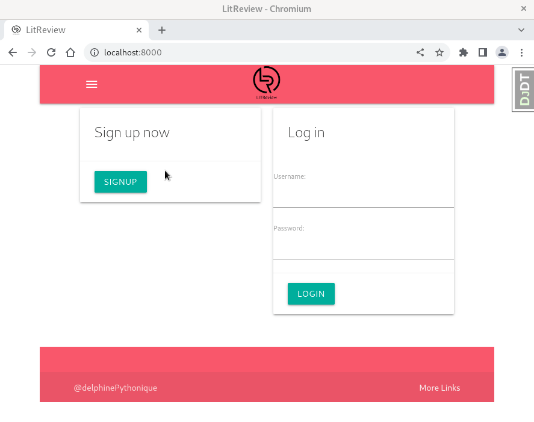

Title: Développer une application de partage de critiques de livres
Date: 2022-09-06 10:20
Category: Certification Développeur Python
tags: front, api, django, python, materializecss, scss
summary: Le projet a pour objectif de développer une application permettant à des internautes de donner ou solliciter des avis sur des livres

## <i class="medium material-icons">assignment</i> Présentation du projet

Le projet a pour objectif de développer une application permettant à des internautes de donner ou solliciter des avis 
sur des livres
## <i class="medium material-icons">view_list</i> Fonctionnalités

- <i class="tiny material-icons">done</i> Demander un avis sur un livre
- <i class="tiny material-icons">done</i> Donner un avis sur un livre
- <i class="tiny material-icons">done</i> Commenter les avis 

## <i class="medium material-icons">school</i> Compétences évaluées

- <i class="tiny material-icons">done</i> Développer une application web en utilisant Django
- <i class="tiny material-icons">done</i> Utiliser le rendu côté serveur dans Django

## <i class="medium material-icons">folder</i> Dépôt du programme
[lien vers le dépôt de ce projet  <i class="tiny material-icons">open_in_new</i>](https://github.com/DelphinePythonique/projet9)

