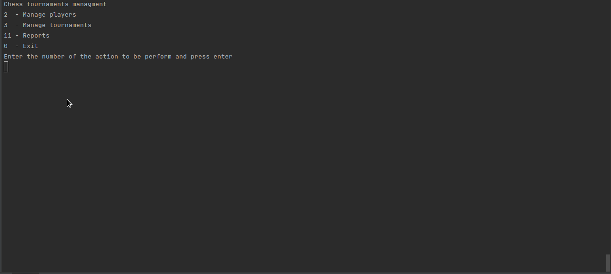

Title: Développer une application de gestion de tournois d'échecs
Date: 2022-09-06 10:20
Category: Certification Développeur Python
tags: MVC, console, python
summary: Le projet a pour objectif de développer une application à destination des organisateurs de tournois d'échec.

## <i class="medium material-icons">assignment</i> Présentation du projet

Le projet a pour objectif de développer une application à destination des organisateurs de tournois d'échec.

## <i class="medium material-icons">view_list</i> Fonctionnalités

 - Gérer un **carnet d'adresse** de joueur
 - Gérer des **tournois** comprenant un nombre de **tour** paramétrable, durant lequel les joueurs inscrits au tournoi 
seront associés en fonction de différents critères pour jouer un **match**. 
Il sera alors possible de mémoriser le résultat des matchs. 
 - Différents rapports seront fournis

## <i class="medium material-icons">school</i> Compétences évaluées

- Utiliser la programmation orientée objet pour développer un programme Python
- Écrire un code Python robuste en utilisant la PEP 8
- Structurer le code d'un programme Python en utilisant un design pattern

## <i class="medium material-icons">folder</i> Dépôt du programme
[lien vers le dépôt de ce projet  <i class="tiny material-icons">open_in_new</i>](https://github.com/DelphinePythonique/projet4)

